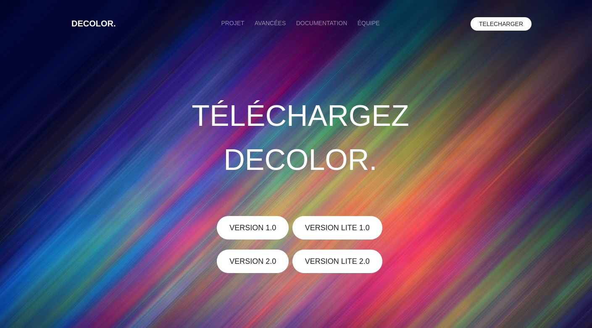

# Decolor

This project is a user-friendly image editing and drawing software developed in C  utilizing SDL and GTK libraries. It combines image processing capabilities with an intuitive graphical user interface, allowing users to unleash their creativity through digital art and image manipulation. The software offers a range of features including drawing tools, pixel-level editing, and undo/redo functionality, all within a clean and simple interface. Users can start with a blank canvas or load existing images for modification, with the ability to save their work easily.

# How to use Decolor ?

- Use the command `make` without any arguments to compile the application.
- Then launch it by using `./decolor`.
- An interface will now appear and allow you to modify and create some images.

You can type `make clean` to clean every trash file and compiled file

# Website

Visit the Decolor [website](https://topagrume.github.io/decolor_web/accueil.html) to find the download link and access all related documentation, including the production specifications and the project report.

